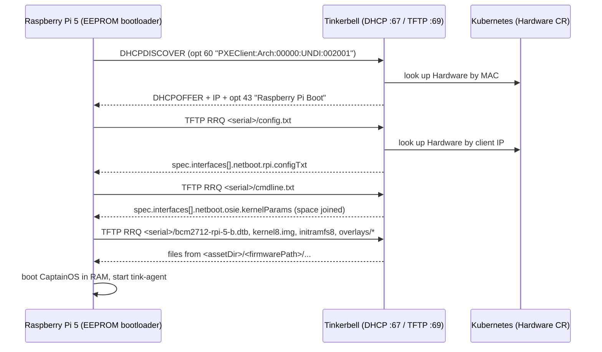

# Network boot a Raspberry Pi 5 with Tinkerbell

This document explains how to network boot a Raspberry Pi 5 into CaptainOS, the Tinkerbell
in-memory provisioning OS, so that `tink-agent` connects back to the Tink server and the Pi is ready
to run Workflows. It covers getting the boot artifacts, configuring Tinkerbell to serve them,
creating the Hardware object, and configuring the Pi's EEPROM, followed by verification and
troubleshooting steps.

A Pi 5 does PXE boot, but not the way most machines do. Its EEPROM bootloader sends a standard
PXE-style DHCP request, but it never chainloads iPXE — it implements its own TFTP client directly
and fetches the kernel, device tree and initramfs itself. Tinkerbell supports this through a
dedicated `rpi-netboot` TFTP route, and the steps below are the Tinkerbell-side configuration that
route needs. See [How Raspberry Pi 5 netboot works](#how-raspberry-pi-5-netboot-works) for the full
detail on how it works under the hood.

## Before you begin

- A Tinkerbell deployment running `--dhcp-mode reservation` (the default), so that Tinkerbell owns
  DHCP for the Pi's subnet. `proxy` needs extra care and `auto-proxy` is not supported — see
  [DHCP modes](#dhcp-modes).
- The Pi 5 wired to Ethernet (Wi-Fi netboot is not supported by the bootloader).
- A writable directory on the Tinkerbell host/pod that holds the TFTP assets Tinkerbell serves.
- To read the Pi's serial number and set its EEPROM configuration, use either the boot diagnostics
  screen and a network update (no SD card required) or a microSD card with Raspberry Pi OS (simpler,
  but not required). Keep a blank FAT32 card with `recovery.bin` on hand regardless — it is the only
  recovery path from a bad EEPROM config.


## 1. Get the boot artifacts

The Pi needs a kernel, an initramfs, a Broadcom device tree, overlays and the Raspberry Pi firmware
files, laid out the way its bootloader expects. Captain publishes all of that as an OCI image.

### From the published OCI image (recommended)

Images are tagged `<version>-<commit>-<flavor>-<arch>`; the Pi 5 flavor is `trixie-armbian-rpi` and
the architecture is `arm64`:

```console
$ REF=ghcr.io/tinkerbell/captain/artifacts:v0.0.0-dd8b328-trixie-armbian-rpi-arm64
$ mkdir -p /var/lib/tinkerbell/tftp && cd /var/lib/tinkerbell/tftp

$ id=$(docker create "$REF" /bin/true)
$ docker export "$id" | tar -x --no-same-owner \
    firmware-rpi dtb-trixie-armbian-rpi-aarch64 \
    vmlinuz-trixie-armbian-rpi-aarch64 initramfs-trixie-armbian-rpi-aarch64
$ docker rm "$id"
```

> [!NOTE]
> The `-arm64` in the tag names the architecture of the *boot artifacts*, which is what matters
> here. The image itself is published as a multi-platform index so that this extraction works on an
> amd64 or an arm64 host; both manifests carry the same Pi 5 artifacts.

The artifacts in the image are organized as follows:

```
vmlinuz-trixie-armbian-rpi-aarch64        # kernel
initramfs-trixie-armbian-rpi-aarch64      # ~106 MB, CaptainOS root
dtb-trixie-armbian-rpi-aarch64/broadcom/  # device trees
firmware-rpi/                             # what the Pi actually requests
```

`firmware-rpi/` is the directory you will name in `firmwarePath`. It contains `kernel8.img`,
`initramfs8`, the Broadcom `.dtb` files and `overlays/`, plus the Raspberry Pi 4 firmware blobs
(`start*.elf`, `fixup*.dat`, `bootcode.bin`) which a Pi 5 ignores.

If you have `skopeo` or captain checked out, `captain release pull` and `skopeo copy` work equally
well — the image is an ordinary OCI image with one layer per artifact.

### Build from source (for customization)

CaptainOS can also be built from source using `captain`, which is useful when you need to change the
image contents. `--flavor-id` and `--arch` are options on the top-level `captain` group, so they go
**before** the `build` subcommand:

```console
$ cd captain
$ uv run captain --flavor-id trixie-armbian-rpi --arch arm64 build
```

The build writes the same layout under `out/`, so everything below applies unchanged with
`--tftp-asset-dir` pointed at `captain/out`.

Whichever route you take, confirm the Pi 5 device tree is present — it is the one thing that
determines whether the kernel can boot a Pi 5. Both the published OCI image and a source build using
the `trixie-armbian-rpi` flavor include it:

```console
$ ls firmware-rpi/bcm2712-rpi-5-b.dtb
```

## 2. Point Tinkerbell at the asset directory

Tinkerbell builds the path for every Raspberry Pi file request by joining the `--tftp-asset-dir`
flag with the Hardware object's `firmwarePath` field and the requested file name:
`<assetDir>/<firmwarePath>/<file>`. If either value doesn't match the directory layout on disk,
every file request returns a 404.

`firmware-rpi/` is full of **relative symlinks that point one level up** — this is true of both the
OCI extraction and a source build:

```console
$ ls -l firmware-rpi
kernel8.img         -> ../vmlinuz-trixie-armbian-rpi-aarch64
initramfs8          -> ../initramfs-trixie-armbian-rpi-aarch64
bcm2712-rpi-5-b.dtb -> ../dtb-trixie-armbian-rpi-aarch64/broadcom/bcm2712-rpi-5-b.dtb
```

Because those symlinks resolve relative to `firmware-rpi/`'s parent directory, point the asset
directory at the **parent** of `firmware-rpi/` and let `firmwarePath` supply the last component (see
[Security](#security) for how Tinkerbell resolves these paths):

```console
$ tinkerbell \
    --dhcp-mode reservation \
    --tftp-asset-dir /var/lib/tinkerbell/tftp \
    --tftp-block-size 1468
```

with `firmwarePath: firmware-rpi` on the Hardware. A request for `<serial>/kernel8.img` then becomes
`firmware-rpi/kernel8.img`, whose `../vmlinuz-…` target still resolves inside the root.

Via Helm:

```yaml
deployment:
  envs:
    smee:
      tftpAssetDir: /var/lib/tinkerbell/tftp
      tftpBlockSize: 1468
```

You will also need a volume mount that makes the assets visible at that path inside the pod.

`--tftp-asset-dir` is empty by default. Both the `rpi-netboot` and disk-asset TFTP routes stay
disabled until it is set. `--tftp-block-size 1468` is the one value worth changing from its default
of 512: it keeps each block inside a 1500-byte MTU and cuts the number of round trips roughly
threefold.

> [!NOTE]
> Leave `--tftp-single-port` at its default of `true`. Multi-port mode makes the server reply from a
> fresh ephemeral port, which cannot work behind a Kubernetes Service — only UDP/69 is mapped. A Pi 5
> boots fine in single-port mode once its `TFTP_FILE_TIMEOUT` is raised in
> [step 4](#4-configure-the-pis-eeprom).

> [!NOTE]
> Do not raise `--tftp-timeout`. It is the per-packet retransmit timeout, and the default is fine;
> if anything, lowering it helps. Some clients silently drop an OACK that negotiates a smaller block
> size than they asked for and then retry the RRQ, and a long timeout leaves Tinkerbell waiting on
> the dead first transfer while it ignores the retries — see
> [#728](https://github.com/tinkerbell/tinkerbell/issues/728), where dropping it from 10s to 2s fixed
> an iDRAC8. This is unrelated to the Pi's own per-file timeout.

One asset directory can serve every Pi. You will notice that `config.txt` and `cmdline.txt` are not
part of the extracted or built image directory. This is because they are defined per Hardware object
and rendered by Tinkerbell rather than read from disk — see
[step 3](#3-create-the-hardware-object).

## 3. Create the Hardware object

You need the Pi's MAC address and serial number. With no boot media inserted, power the Pi on and
read the `board` line of the HDMI boot diagnostics screen — it shows `revision  serial  MAC`:

```
board: c04170 a1b2c3d4 dc:a6:32:4b:2c:1a
```

From a running Raspberry Pi OS instead:

```console
$ cat /proc/cpuinfo | grep Serial
Serial          : 10000000a1b2c3d4
$ ip link show eth0 | awk '/link\/ether/ {print $2}'
dc:a6:32:4b:2c:1a
```

The TFTP prefix is the **last 8 characters** of the serial. `serialNum` accepts either that or the
full value.

Tinkerbell resolves `config.txt` and `cmdline.txt` **by the client's IP address**, so the DHCP
reservation and the netboot config must be on the same Hardware object.

```yaml
apiVersion: tinkerbell.org/v1alpha1
kind: Hardware
metadata:
  name: rpi5-01
  namespace: tinkerbell
spec:
  interfaces:
    - dhcp:
        mac: dc:a6:32:4b:2c:1a
        hostname: rpi5-01
        arch: arm64
        name_servers:
          - 1.1.1.1
        ip:
          address: 192.168.2.101
          netmask: 255.255.255.0
          gateway: 192.168.2.1
      netboot:
        allowPXE: true
        rpi:
          serialNum: "a1b2c3d4"
          firmwarePath: firmware-rpi
          configTxt: |
            [all]
            enable_uart=1
            uart_2ndstage=1
            kernel=kernel8.img
            initramfs initramfs8 followkernel
            device_tree=bcm2712-rpi-5-b.dtb
            disable_splash=1
        osie:
          kernelParams:
            - console=tty1
            - console=ttyAMA10,115200
            - grpc_authority=192.168.2.50:42113
            - tinkerbell_tls=false
            - tinkerbell_insecure_tls=true
            - syslog_host=192.168.2.50
            - facility=onprem
            - worker_id=dc:a6:32:4b:2c:1a
            - hw_addr=dc:a6:32:4b:2c:1a
            - tink_worker_image=ghcr.io/tinkerbell/tink-agent:latest
```

How the netboot fields map to TFTP requests:

| Pi requests | Tinkerbell serves |
| --- | --- |
| `a1b2c3d4/config.txt` | `netboot.rpi.configTxt` verbatim |
| `a1b2c3d4/cmdline.txt` | `netboot.osie.kernelParams` joined with spaces |
| `a1b2c3d4/kernel8.img` | `<assetDir>/firmware-rpi/kernel8.img` |
| `a1b2c3d4/overlays/x.dtbo` | `<assetDir>/firmware-rpi/overlays/x.dtbo` |

> [!IMPORTANT]
> **`firmwarePath` is required even if you only want `configTxt`.** The `rpi-netboot` route checks
> `serialNum != "" && firmwarePath != ""` *before* it handles `config.txt` and `cmdline.txt`, so
> leaving `firmwarePath` unset silently disables the inline templates too — even though neither of
> them touches the disk. The symptom is `hardware does not have RPI data; skipping` at `-v 1`
> followed by a 404 for `config.txt`.

`worker_id` is what `tink-agent` reports to the Tink server, and it must match the
`spec.hardwareMap` value in the Workflow you later create. `grpc_authority` and `syslog_host` point
at your Tinkerbell IP.

## 4. Configure the Pi's EEPROM

```ini
[all]
BOOT_UART=1
BOOT_ORDER=0xf12
TFTP_PREFIX=0
TFTP_FILE_TIMEOUT=300000
NET_INSTALL_ENABLED=0
ENABLE_SELF_UPDATE=1
```

> [!IMPORTANT]
> **Set `TFTP_FILE_TIMEOUT=300000`.** This is the per-file TFTP timeout in milliseconds and defaults
> to **30000**. A CaptainOS initramfs is ~106 MB, which takes on the order of two minutes over
> single-port TFTP, so the default 30 s timeout aborts the transfer partway through and the kernel
> panics with no root filesystem. See [Troubleshooting](#troubleshooting) for what that looks like.

Apply this configuration using one of the two options below.

### Option A — from a Raspberry Pi OS SD card

Install Raspberry Pi OS on a spare SD card, boot the Pi from it, and run:

```console
$ sudo apt update && sudo apt full-upgrade
$ sudo rpi-eeprom-update -a
$ sudo rpi-eeprom-config --edit
```

Reboot to apply, then remove the SD card.

### Option B — over the network, no SD card

With `ENABLE_SELF_UPDATE=1` (the default) the bootloader looks for `pieeprom.upd` and `pieeprom.sig`
in its TFTP boot directory on every boot. If the image differs from what is flashed, it applies it
and resets. A Pi that is already netbooting will therefore pick up a new EEPROM config on its own —
you will see it request `<serial>/pieeprom.sig` in the Tinkerbell log even before you provide the
files.

The `rpi-eeprom` tools are Python and shell scripts, so the image is built on a plain **amd64** host
using an ordinary `debian:trixie-slim` container — no qemu and no `--platform` needed. Only the
resulting EEPROM image is for the Pi.

```console
$ cat > /tmp/boot.conf <<'EOF'
[all]
BOOT_UART=1
BOOT_ORDER=0xf12
TFTP_PREFIX=0
TFTP_FILE_TIMEOUT=300000
NET_INSTALL_ENABLED=0
ENABLE_SELF_UPDATE=1
EOF

$ docker run --rm \
    -v /tmp/boot.conf:/work/boot.conf:ro \
    -v /var/lib/tinkerbell/tftp/firmware-rpi:/out \
    debian:trixie-slim bash -euxc '
      apt-get update -qq
      apt-get install -y -qq --no-install-recommends git python3 openssl ca-certificates

      git clone --depth 1 https://github.com/raspberrypi/rpi-eeprom /work/rpi-eeprom
      cd /work/rpi-eeprom

      # BCM2712 = Pi 5.
      BASE=$(ls -1 firmware-2712/latest/pieeprom-*.bin | sort | tail -1)
      echo "base image: $BASE"

      ./rpi-eeprom-config --config /work/boot.conf --out /out/pieeprom.upd "$BASE"
      ./rpi-eeprom-digest -i /out/pieeprom.upd -o /out/pieeprom.sig

      echo "=== resulting config ==="
      ./rpi-eeprom-config /out/pieeprom.upd

      chown "$(stat -c "%u:%g" /out)" /out/pieeprom.upd /out/pieeprom.sig
    '
```

The two files land inside `firmware-rpi/`, which is already the `firmwarePath`, so Tinkerbell serves
them at `<serial>/pieeprom.upd` and `<serial>/pieeprom.sig` with no extra configuration.
Power-cycle the Pi; it flashes the EEPROM and resets, and the *next* boot uses the new timeout.

Notes on this procedure:

- Name the output **`pieeprom.upd`**, not `.bin`. With `.upd`, `recovery.bin` renames itself
  afterwards and boot continues; with `.bin` the bootloader stops and shows a green recovery screen
  instead of continuing to boot.
- `firmware-2712/latest` tracks newer features; `firmware-2712/default` is the conservative stream.
  If the glob is empty, `ls firmware-2712/` — the layout has shifted between releases.
- The trailing `rpi-eeprom-config /out/pieeprom.upd` prints the config back; confirm
  `TFTP_FILE_TIMEOUT` is set correctly before rebooting the Pi.
- To verify it applied, compare `update-ts` on the HDMI diagnostics screen before and after.
- Keep a FAT32 SD card with `recovery.bin` handy. A bad EEPROM config can leave the Pi unbootable
  and that is the only way back.

## 5. Boot and verify

Power-cycle the Pi with no SD card inserted. On the console you should see the bootloader acquire an
IP, read `config.txt` from the serial-prefixed directory, then load the kernel and initramfs.

Watch the Tinkerbell logs to confirm each route hit:

```console
$ kubectl logs -n tinkerbell deployment/tinkerbell -f | grep -E 'rpi-netboot|template served|asset served'
```

The line that tells you it worked is the initramfs completing rather than aborting:

```json
{"msg":"rewritten asset served from disk","filename":"a1b2c3d4/initramfs8","bytesSent":106156212}
```

`bytesSent` must equal the full file size. Anything smaller, paired with `serving rewritten asset
failed` and `Early terminate`, means the Pi gave up — see [Troubleshooting](#troubleshooting).

Once CaptainOS is up, `tink-agent` registers with the Tink server and the Pi is ready for a Workflow.

## Security

Tinkerbell resolves every asset request relative to the configured asset directory and refuses to
serve a path that would resolve outside of it, whether the escape attempt comes from a symlink in
the served files or from `..` or an absolute path in the request itself. The serial-prefix rewrite
described in [step 3](#3-create-the-hardware-object) happens entirely inside Tinkerbell; the Pi is
never redirected to another server.

## Reference

### Tinkerbell settings that matter here

| Flag / Helm value | Default | Notes |
| --- | --- | --- |
| `--tftp-asset-dir` / `tftpAssetDir` | `""` | Must be the **parent** of `firmware-rpi/`. Empty disables the `rpi-netboot` and disk-asset routes entirely. |
| `--tftp-block-size` / `tftpBlockSize` | `512` | Set to `1468`. Values ≤ 512 are silently ignored — `SetBlockSize` in `pin/tftp` only applies above 512. |
| `--tftp-single-port` / `tftpSinglePort` | `true` | Leave `true`. `false` breaks behind a Kubernetes Service. |
| `--tftp-timeout` / `tftpTimeout` | `10s` | Per-packet retransmit timeout. Leave alone or lower; never raise. |
| `--dhcp-mode` | `reservation` | See [DHCP modes](#dhcp-modes). |

### DHCP modes

| Mode | Pi 5 support | Requirements |
| --- | --- | --- |
| `reservation` | Supported | None beyond [step 3](#3-create-the-hardware-object). |
| `proxy` | Conditional | A Hardware object whose `spec.interfaces[].dhcp.ip.address` matches the address the external DHCP server leases, with `netboot.rpi.serialNum`, `netboot.rpi.firmwarePath`, `netboot.rpi.configTxt` and `netboot.osie.kernelParams` all populated. Keeping the address in sync with the lease is your responsibility; nothing warns you when it drifts. |
| `auto-proxy` | Unsupported | Makes no backend calls, so there is no Hardware object to read `serialNum` or `configTxt` from. |

See [Identification is by IP address](#identification-is-by-ip-address) for why.

### EEPROM settings that matter here

| Property | Value | Why |
| --- | --- | --- |
| `TFTP_FILE_TIMEOUT` | `300000` | Per-file timeout, default 30000. Too low for a 106 MB initramfs. |
| `BOOT_ORDER` | `0xf12` | Read right to left: `2` network, `1` SD, `f` restart. `0xf2` for network-only. |
| `TFTP_PREFIX` | `0` | Serial-number prefix. `2` uses the MAC instead, which `rpi-netboot` does not match. |
| `NET_INSTALL_ENABLED` | `0` | Skips the keyboard wait for Raspberry Pi Imager. |
| `BOOT_UART` | `1` | Bootloader progress on the debug UART. |
| `ENABLE_SELF_UPDATE` | `1` | Enables the network EEPROM update in [option B](#option-b--over-the-network-no-sd-card). |
| `TFTP_IP` | — | Set to Tinkerbell's IP if the Pi and Tinkerbell are on different subnets and you are not relaying DHCP. |

## How Raspberry Pi 5 netboot works

The following describes how a Raspberry Pi 5 network boots and why the configuration above is
needed. It is not required to follow the steps above.

A Pi 5's DHCP handshake looks like standard PXE — its DHCPDISCOVER carries the same `PXEClient`
option other network-booting machines send — but it doesn't do UEFI PXE boot or chainload iPXE.
Its second-stage bootloader lives in the on-board SPI EEPROM and implements its own DHCP and TFTP
client. Three consequences shape everything above.

**There is no `start4.elf` on a Pi 5.** On a Pi 4 the bootloader fetches `start4.elf` as second-stage
GPU firmware. On a Pi 5 that firmware is embedded in the EEPROM, so the bootloader goes straight from
`config.txt` to loading the kernel, device tree and initramfs. Raspberry Pi describe it as the
bootloader having "an embedded version of `start.elf`".

**Every request is prefixed with a per-device directory.** With `TFTP_PREFIX=0` that prefix is the
low 8 hex digits of the serial number, e.g. `a1b2c3d4/config.txt`. Tinkerbell's `rpi-netboot` route
understands this addressing and rewrites the non-template paths into `firmwarePath`.

**The DHCP offer must say `Raspberry Pi Boot`.** The bootloader ignores offers whose option 43 lacks
that string. Tinkerbell adds it automatically when the client MAC matches a Raspberry Pi OUI.

### Identification is by IP address

A TFTP read request carries only a filename and a source address, so when the Pi asks for
`<serial>/config.txt` the only way Tinkerbell can tell which machine is asking is the client's IP.
The `rpi-netboot` route therefore looks the Hardware up by IP
([route_rpi.go](/smee/internal/ipxe/binary/route_rpi.go)), and the serial number in the request path
is not used for the lookup — it is only checked as a prefix and then rewritten.

That is why `--dhcp-mode` matters. Under `reservation` Tinkerbell assigns the address itself, so the
lookup always matches. Under the proxy modes an external server assigns it, and Tinkerbell has no
way to learn the binding, so it can only match an address you have written into the Hardware object
by hand.

When the lookup misses, the route returns "not handled" and the request falls through to a 404. From
the outside nothing looks wrong: Tinkerbell answers DHCP normally and logs
`"bootFileName":"snp-arm64.efi"`, the Pi then fails to read `config.txt`, discards what it has, probes
the default kernel names and loops. `failed to get hardware by IP; skipping` at `-v 1` is the only
signal.



## Troubleshooting

**The Pi never sends a TFTP request; DHCP repeats.**
The bootloader ignores DHCP offers that lack `Raspberry Pi Boot` in option 43. Tinkerbell adds that
suboption only when the client MAC starts with a known Raspberry Pi OUI. The recognised prefixes are
`B8:27:EB`, `DC:A6:32`, `E4:5F:01`, `28:CD:C1` and `D8:3A:DD`
([dhcp.go](/smee/internal/dhcp/dhcp.go)). If your Pi uses a newer OUI that is not in that list,
Tinkerbell will neither inject option 43 nor override the architecture, and netboot will not start.
Check the MAC against the list first; a Pi with an unrecognised OUI needs the list extended.

**Kernel boots, then panics with `VFS: Unable to mount root fs on unknown-block(0,0)`.**
The initramfs did not load. `unknown-block(0,0)` means no root device *and* no initramfs, which is
exactly what you get when `cmdline.txt` (correctly) has no `root=` because CaptainOS runs from RAM.
Check the Tinkerbell log for the `initramfs8` transfer:

```json
{"msg":"serving rewritten asset failed","filename":"a1b2c3d4/initramfs8",
 "err":"sending block 60473: code=0, error: Early terminate","bytesSent":88774364}
```

`Early terminate` is a TFTP ERROR packet sent **by the Pi**, not a server failure. Subtract the
timestamps of the preceding `attempting to load rewritten file` line and this one: if the gap is
~30 s, the bootloader hit `TFTP_FILE_TIMEOUT` and gave up mid-transfer. Raise it as described in
[step 4](#4-configure-the-pis-eeprom). Dividing `bytesSent` by the block number gives the negotiated
block size, which is a quick way to confirm `--tftp-block-size` took effect.

This also explains why `kernel8.img` succeeds while `initramfs8` fails: both are subject to the same
timeout, but `kernel8.img` is small enough to finish within 30 s and the initramfs is not.

**Every binary 404s with `no such file or directory`, but `config.txt` works.**
The asset directory and `firmwarePath` are joined together to form the real path — they are not
alternatives to each other. Compare the `rewritten` and
`assetDir` fields in the log against what is on disk — `"rewritten":"firmware-rpi/kernel8.img"` with
`"assetDir":".../tftp/firmware-rpi"` means you have doubled up a level. See
[step 2](#2-point-tinkerbell-at-the-asset-directory).

**Binaries 404 even though the paths look right.**
If the asset directory is rooted at `firmware-rpi/` itself, the relative symlinks (`../vmlinuz-…`,
`../dtb-…`) escape the root and `os.OpenRoot` refuses them. Root at the parent instead, or
dereference them with `cp -rL`.

**TFTP requests arrive without the serial prefix.**
The bootloader drops the prefix when the prefixed directory does not look bootable — on a Pi 5 that
means `config.txt` plus a usable device tree. In practice this is almost always caused by
`config.txt` 404ing, and the usual reason for *that* is an unset `firmwarePath` (see the note in
[step 3](#3-create-the-hardware-object)), not an empty `configTxt`.

**Requests are prefixed with the MAC address, not the serial.**
`TFTP_PREFIX` is set to `2` in the EEPROM. Set it back to `0`.

**`rpi-netboot` never appears in the logs.**
The route is skipped whenever `--tftp-asset-dir` is empty, no Hardware matches the client IP, or
either `serialNum` or `firmwarePath` is unset. All of these are logged at `-v 1`; raise
`--log-level 1` or `--smee-log-level 1` to see them. `failed to get hardware by IP; skipping` under `--dhcp-mode proxy` or
`auto-proxy` is the mismatch described in [DHCP modes](#dhcp-modes).

**Transfers are slow.**
TFTP here is strictly lock-step — `github.com/pin/tftp/v3` has no RFC 7440 windowsize support — so
every block costs a round trip, and transfer speed is limited by round-trip latency rather than link
bandwidth. Set `--tftp-block-size 1468`; values ≤ 512 are silently ignored. Beyond that, the fix is a
longer `TFTP_FILE_TIMEOUT`, not a faster transfer.

**Kernel loads but panics or hangs with no output.**
Confirm `device_tree=` names a device tree that exists for your board and that the kernel actually
supports BCM2712. Add `console=ttyAMA10,115200` to `kernelParams` and `enable_uart=1` to `configTxt`
so you can see the failure.

### Harmless log noise

These 404s are expected and do not stop the boot — the files are optional and the firmware
continues past them:

- `pieeprom.sig` — the EEPROM self-update probe. Supplying it is [Option B](#option-b--over-the-network-no-sd-card).
- `overlay_map.dtb`, `armstub8-2712.bin` — optional firmware assets.

Likewise, `bytesSent: 0` together with `sending block 0: … Early terminate` on `config.txt` or
`kernel8.img` is the bootloader's existence probe: it reads the first block and cancels.

## Related documentation

- [PORTS_AND_ENDPOINTS.md](/docs/technical/PORTS_AND_ENDPOINTS.md) — full TFTP route table and
  precedence rules
- [DHCP.md](/docs/technical/smee/DHCP.md) — Tinkerbell DHCP modes
- [CAPTAINOS.md](/docs/technical/CAPTAINOS.md) — CaptainOS overview and kernel parameters
- [Raspberry Pi bootloader configuration](https://www.raspberrypi.com/documentation/computers/raspberry-pi.html#raspberry-pi-bootloader-configuration)
