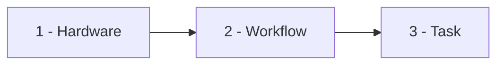
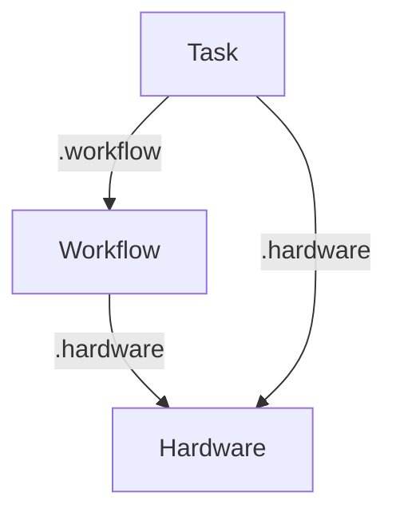

# v1alpha2 Templating

When a Workflow is created, Tinkerbell renders the Hardware, Workflow, and Tasks involved. Each of these objects can be templated, and each has access to a fixed set of data sources. This document describes the available data sources, how to refer to them, the order in which objects are rendered, and the constraints on their usage.

## Background

Tinkerbell renders `Hardware`, `Workflow`, and `Task` objects with [Go `text/template`](https://pkg.go.dev/text/template) plus the [Sprig](https://masterminds.github.io/sprig/) function library (the same engine used by v1alpha1). Template expressions are written inline as `{{ ... }}` within string fields and are evaluated at render time, before the object is used.

This document describes the top-level data available to templates in the `Hardware`, `Workflow`, and `Task` objects, how rendering is ordered, and the constraints the Kubernetes API places on where templating can be used.

## Overview

Each object can template against a fixed set of top-level data sources. Every object can always reference **itself** and its own **references**; `Workflow` and `Task` can additionally reference the `Hardware` object, and a `Task` can also reference the `Workflow` that runs it.

| Object | Self | References | Hardware | Workflow |
| --- | --- | --- | --- | --- |
| `Hardware` | `.hardware` | `.references` | — | — |
| `Workflow` | `.workflow` | `.references` | `.hardware` | — |
| `Task` | `.task` | `.references` | `.hardware` | `.workflow` |

### Render order

Objects are rendered in a fixed order — `Hardware`, then `Workflow`, then `Task` — so that when a later object references an earlier one, the referenced values are already fully rendered.



### Dependencies

Each object can reference the data sources of earlier-rendered objects. The arrows below point from the object that contains the template to the object whose data it references. (Every object can also reference itself and its own references; those are omitted here for clarity.)



### Reference scope

- **`.references` is object-local, always.** `Hardware`, `Task`, and `Workflow` can each only read their *own* `spec.references`. No object can read another object's references.
- **Cross-object data flows only through rendered spec fields.** For a Task to use Workflow reference data, the `Workflow` renders its own reference into one of its spec fields (for example `globals.env` or `templateMap`), and the Task reads that already-rendered field via `.workflow.spec.*`.

For example, a Workflow renders its own reference into a spec field:

```yaml
# Workflow
spec:
  references:
    mysecret:
      name: "secret01"
      namespace: "tinkerbell"
      resource: "secrets"
      version: "v1"
  globals:
    env:
      # A Workflow may template its OWN reference into a spec field.
      SECRET_DATA: "{{ .references.mysecret.data | b64dec }}"
```

The Task then reads the already-rendered value from the Workflow's spec — never from `.workflow.references`:

```yaml
# Task
spec:
  actions:
    - name: "write data"
      image: "alpine"
      command: "/bin/sh"
      args:
        - "-c"
        - "echo {{ .workflow.spec.globals.env.SECRET_DATA }} > /tmp/data.txt"
```

## How template data is addressed

At render time each object is evaluated against its JSON representation, so every path segment is a **key lookup using the JSON field name**, not the Go struct field name:

- Paths use the lowercase/camelCase JSON names, e.g. `.hardware.spec.attributes.arch`, not `.Hardware.Spec.Attributes.Arch`.
- Lookups are **case-sensitive**. `.task.spec.env.one` matches the key `one`; it will not match `One` or `ONE`.
- Dot access only works for keys that are valid template identifiers (letters, digits, `_`, not starting with a digit). For any other key — MAC addresses, keys containing `.` or `-`, etc. — use the `index` function:

  ```gotemplate
  {{ (index .hardware.spec.networkInterfaces "52:54:00:41:05:c6").ipam.ipv4.address }}
  ```

- When a referenced value's key itself contains a dot, escape the dot so it is treated as a single key segment:

  ```gotemplate
  {{ .references.registryCert.data.ca\.crt | b64dec | nindent 12 }}
  ```

## Hardware templating

The following top-level fields are available to template functions inside a `Hardware` object.

| Field | Description |
| --- | --- |
| `.references` | User-defined references declared on the Hardware (`spec.references`). |
| `.hardware` | The Hardware object itself (self-reference). |

### `.references`

References work the same way they do in v1alpha1. Entries under `spec.references` name external objects to fetch, and the fetched objects are available under `.references.<name>`.

```gotemplate
{{ .references.registryCert.data.ca\.crt | b64dec | nindent 12 }}
```

### `.hardware`

`.hardware` exposes the `Hardware` object to itself, letting one field reference another field within the same `Hardware` object. As with `.task`, this is similar to a YAML anchor but resolved by the template engine.

```gotemplate
# Reference another field in this same Hardware object
{{ .hardware.spec.instance.sshKeys[0] }}

# Build a value from a map-keyed interface
{{ (index .hardware.spec.networkInterfaces "52:54:00:41:05:c6").ipam.ipv4.address }}/{{ (index .hardware.spec.networkInterfaces "52:54:00:41:05:c6").ipam.ipv4.prefix }}
```

## Workflow templating

A `Workflow` orchestrates one or more `Tasks` and binds them to `Hardware`. The following top-level fields are available to template functions inside a `Workflow` object.

| Field | Description |
| --- | --- |
| `.workflow` | The Workflow object itself (self-reference). |
| `.references` | User-defined references declared on the Workflow. |
| `.hardware` | The `Hardware` object bound to a task via `spec.tasks[].hardware.hardwareRef`. |

### `.workflow`

`.workflow` exposes the `Workflow` object to itself, letting one field reference another field within the same `Workflow`. As with `.task` and `.hardware`, this is similar to a YAML anchor but resolved by the template engine.

```gotemplate
# Reference another field in this same Workflow object
{{ .workflow.spec.globals.templateMap.globalKey }}
```

### `.references`

References work the same way they do in v1alpha1. Entries name external objects to fetch, and the fetched objects are available under `.references.<name>`.

```gotemplate
{{ .references.clusterConfig.data.registryURL }}
```

### `.hardware`

When a task sets `spec.tasks[].hardware.hardwareRef`, `.hardware` provides access to that entire `Hardware` object. The `Hardware` object is rendered before the `Workflow` (see [Rendering order](#rendering-order)), so its values are already fully rendered.

```gotemplate
{{ .hardware.spec.attributes.arch }}
```

## Task templating

A `Task` is a reusable definition of `Actions`. When a `Workflow` runs a `Task`, the following top-level fields are available to template functions inside the `Task` object.

| Field | Description |
| --- | --- |
| `.hardware` | The `Hardware` object bound to this Task by the Workflow. |
| `.references` | User-defined references declared on the Task (`spec.references`). |
| `.task` | The Task object itself (self-reference). |
| `.workflow` | The Workflow object that is running this Task. |

### `.hardware`

If the `Workflow` that uses the `Task` sets `spec.tasks[].hardware.hardwareRef`, then `.hardware` provides access to that entire `Hardware` object.

- The referenced `Hardware` object is rendered first (see [Rendering order](#rendering-order)) — any templating in the `Hardware` object is resolved **before** the `Task` is rendered. As a result, `.hardware` values seen by the Task are already fully rendered.
- **Caveat:** references are object-local. The `Hardware` object's own references (`.hardware.spec.references`) are **not** available to the Task. A Task can only read its own `spec.references` (see [Reference scope](#reference-scope)).

```gotemplate
# Access hardware attributes
{{ .hardware.spec.attributes.arch }}

# Conditional on a hardware attribute
{{ eq .hardware.spec.attributes.arch "amd64" }}

# Access a map-keyed network interface field
{{ (index .hardware.spec.networkInterfaces "52:54:00:41:05:c6").ipam.ipv4.gateway }}
```

### `.references`

References work the same way they do in v1alpha1. Each entry under `spec.references` names an external object to fetch; the fetched object is then available under `.references.<name>`.

```yaml
spec:
  references:
    clusterConfig:
      name: "cluster-settings"
      namespace: "tinkerbell"
      resource: "configmaps"
      version: "v1"
```

```gotemplate
# Access the fetched ConfigMap's data
{{ .references.clusterConfig.data.registryURL }}
```

Each reference is identified by `name`, `namespace`, `resource` (the lowercase, pluralized kind), and `version` (and optionally `group`). Access and rendering of a reference require the appropriate policies to be in place.

### `.task`

`.task` exposes the `Task` object to itself, letting one field reference another field in the same `Task`. This is conceptually similar to what a YAML anchor accomplishes, but it is resolved by the template engine at render time.

```yaml
spec:
  env:
    one: "1"
  actions:
    - name: "sleep"
      image: "alpine"
      command: "/bin/sleep"
      args:
        # Reference another field in this same Task
        - "{{ .task.spec.env.one }}"
```

### `.workflow`

`.workflow` gives the `Task` access to fields on the `Workflow` that references it (the taskRef field in the Workflow Spec), at render time. This is how per-run values (globals, template maps, per-task extras) can be referenced by a Task.

Any value in the Workflow's spec can be accessed via `.workflow.spec`. The Workflow's `references` are **not** accessible to the Task; to pass reference-derived data, the Workflow must render its own reference into a spec field that the Task then reads (see [Reference scope](#reference-scope)).

```gotemplate
# Read a value from the Workflow's global templateMap, defaulting to "1"
{{ default "1" .workflow.spec.globals.templateMap.globalKey }}
```

Because `.workflow` values are user-supplied and may be absent, prefer null-safe lookups for deep paths (see [Safe lookups and defaults](#safe-lookups-and-defaults)).

The `Workflow` is rendered before the `Task` (see [Rendering order](#rendering-order)), so the `.workflow` values a Task sees are already fully rendered.

### The `if` conditional on Actions

Each Action has an optional `if` field that determines whether the Action runs. It is a string boolean intended to be produced by templating:

- The rendered value must be `"true"`, `"false"`, or `""` (empty).
- Empty or unset is treated as `true`.
- Any rendered value other than `"true"`, `"false"`, or `""` is treated as `false`.

```yaml
actions:
  - name: "only on amd64"
    if: '{{ eq .hardware.spec.attributes.arch "amd64" }}'
    image: "alpine"
```

Templating runs before the value is interpreted, so it is the **template output** — not the raw field — that must resolve to `true`/`false`/`""`.

## Rendering order

Objects are rendered in a fixed order so that any object referencing an earlier one always sees fully rendered values:

1. **`Hardware`** is rendered first. Its `.hardware` (self) and `.references` are resolved at this point.
2. **`Workflow`** is rendered next. It can reference `.workflow` (self), `.references`, and the already-rendered `.hardware`.
3. **`Task`** is rendered last. It can reference `.task` (self), `.references`, the already-rendered `.hardware`, and the already-rendered `.workflow`.

Two consequences of this ordering:

- Because `Hardware` and `Workflow` are rendered before the `Task`, the `.hardware` and `.workflow` values a Task sees are final.
- References are object-local: no object's `.references` are exposed to any other object. Each object reads only its own `spec.references`. To pass reference-derived data across objects, render it into a spec field that the consuming object reads (see [Reference scope](#reference-scope)).

## Safe lookups and defaults

Two Sprig helpers are commonly used to supply fallbacks; they differ in how they handle missing data:

- **`default`** substitutes its default whenever the value is empty/falsy (`nil`, `""`, `0`, `false`), but it only guards the **final** value. Traversing a dot path through a missing intermediate key raises a template error.

  ```gotemplate
  {{ default "1" .workflow.spec.globals.templateMap.globalKey }}
  ```

- **`dig`** walks each key safely and returns its default if **any** key along the path is missing — but it only defaults on *absent* keys, not on present-but-empty values.

  ```gotemplate
  {{ dig "spec" "globals" "templateMap" "envTwo" "2" .workflow }}
  ```

To get both null-safe traversal **and** empty-value fallback, give `dig` an empty default and wrap it in `default`:

```gotemplate
{{ default "2" (dig "spec" "globals" "templateMap" "envTwo" "" .workflow) }}
```

## Constraints: value templating only

`Task`, `Workflow`, and `Hardware` are structured Kubernetes CRDs. The Kubernetes API server validates each object against its OpenAPI schema **before** any templating runs, and stores the template text verbatim. This has two consequences:

1. **Templates may only appear inside string leaf values.** Expressions like `image: "{{ ... }}"` or `command: "/bin/{{ ... }}"` are fine because the `{{ ... }}` is just characters within a string field.
2. **Structural templating is not possible.** You cannot use `{{ if }}`/`{{ else }}`/`{{ range }}` to conditionally emit or omit keys or list entries (for example, choosing between two entirely different Actions). The object must already be schema-valid structured data at admission time, so control flow that generates YAML structure is rejected by the API server.

To express a conditional, keep the branching **inside** a single field's value rather than around structure:

```yaml
# Works: the conditional resolves to a string value within one field.
env:
  IMAGE: '{{ if regexMatch "a(arch|rm)" (lower .hardware.spec.attributes.arch) }}alpine:latest{{ else }}quay.io/tinkerbell/actions/kexec:latest{{ end }}'
```

```yaml
# Not possible: control flow that adds/removes keys or list items.
# {{ if ... }}
# - name: "reboot"
# {{ else }}
# - name: "kexec"
# {{ end }}
```

Note also that field-level schema validation applies to the raw template text. For example, if a field enforces a pattern (such as a unix-path pattern that disallows spaces), a template containing spaces — like `{{ eq .a .b }}` — will fail validation on that field. Keep templated content compatible with the field's own schema constraints, and place free-form values (such as command arguments) in fields without restrictive patterns.

## Quoting templates in YAML

Because `{{ ... }}` frequently contains quotes, choose a YAML quoting style that avoids escaping:

- Single-quoted YAML (`'{{ eq .a "b" }}'`) passes inner double quotes through literally.
- Double-quoted YAML (`"{{ eq .a \"b\" }}"`) requires escaping inner double quotes.

Both parse to the identical string that the template engine receives, so they are equivalent — single quotes are usually more readable for templates that contain double-quoted string literals.
